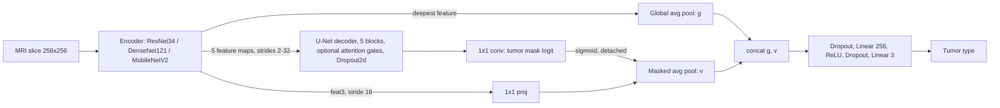

# Robustness-Aware Multi-Task Brain Tumor MRI: Research DOC

**Joint tumor classification + segmentation on the Figshare brain tumor dataset, evaluated with patient-level splits, perturbations, adversarial attacks and MC-dropout uncertainty**

- **Project:** Leakage-free, robustness-aware benchmark for brain tumor MRI models
- **Authors:** Anika Jalan, Nandini Nautiyal, Siya Aggarwal, Aindrila Kundu, Ryena Dhingra (NSUT, Delhi)
- **Period:** October 2026 (pipeline built and debugged) · full experiment run: `[add date]`
- **Dataset:** Figshare brain tumor dataset (Cheng et al.): 3,064 T1-CE slices, 233 patients, 3 tumor types, manual tumor masks
- **Reference papers:** DeepSeg (Zeineldin et al., IJCARS 2020) · Khan et al. (CSBJ 2022) · Attention U-Net (Oktay et al., 2018)
- **Repository:** `github.com/nandininautiyal/brain-tumor-multitask`
- **Status:** all 8 configurations completed on **fold 0 only**; 5-fold CV and multiple seeds still to do

## Table of Contents
1. [Goals](#goals)
2. [Published Claims vs. Our Findings](#published-claims-vs-our-findings)
3. [Source Vetting and Replication Fidelity](#source-vetting-and-replication-fidelity)
4. [Stages of Work](#stages-of-work)
5. [Per-Run Results](#per-run-results)
6. [Model Design](#model-design)
7. [Code Layout and Training Settings](#code-layout-and-training-settings)
8. [Main Takeaways](#main-takeaways)
9. [Caveats and Future Work](#caveats-and-future-work)
10. [Appendix: Cross-Check of the Draft Paper](#appendix-cross-check-of-the-draft-paper)

---

## Goals

Published brain-tumor classifiers on Figshare report 96-98% accuracy, but (a) the data ships as 2D slices and many pipelines shuffle slices before splitting, so slices from the same patient land in both train and test, and (b) almost none stress-test the model. The goal here:

1. Build one modular multi-task U-Net (segmentation + tumor type) with swappable pretrained encoders.
2. Evaluate under **strict patient-level splits** and measure the effect of the **slice-level protocol** on the same architecture.
3. Stress-test every model with noise, bias field, gamma shift, FGSM and PGD (white-box, joint seg+cls loss).
4. Measure calibration and whether MC-dropout uncertainty can flag misclassified or attacked inputs.
5. Ablate attention gates and mask-guided classification; test fast-FGSM adversarial training.

## Published Claims vs. Our Findings

| Quantity | Prior work | Ours | Comparable? |
|---|---|---|---|
| Figshare 3-class accuracy, slice-level split | Khan et al.: **97.8%** (23-layer CNN) | **97.7%** (ResNet34 multi-task, slice-level) | Same protocol, different architecture. Agreement suggests the leaky protocol reproduces published numbers |
| Figshare 3-class accuracy, patient-level split | not reported | **98.6%** (fold 0) | Single fold, 47 test patients |
| Segmentation Dice | DeepSeg: 0.81-0.84 (**BraTS 2019 FLAIR**, multi-class labels) | 0.754-0.805 (**Figshare T1-CE**, binary mask) | **No.** Different dataset, modality and label scheme. Context only |
| Accuracy under PGD, eps=4/255 | not reported by either paper | 29.9% (standard), 84.8% (adversarially trained) | n/a |

Our dataset statistics match Khan et al.'s Table 2 exactly (708 meningioma / 1,426 glioma / 930 pituitary slices), and no patient carries more than one label.

## Source Vetting and Replication Fidelity

**Retracted source excluded.** One of the three supplied PDFs ("U-Net-Based Medical Image Segmentation", Yin et al., J. Healthc. Eng. 2022) was **retracted by Hindawi in October 2023** after an investigation found indicators of systematic manipulation of the publication process, including peer-review manipulation and inappropriate citations. Its performance table also mixes incomparable datasets and metrics. It is **not cited**; U-Net, Attention U-Net and nnU-Net are cited from their original papers.

**What we reproduce and what we do not**
- We did **not** re-implement Khan et al.'s 23-layer CNN or DeepSeg's exact decoder. We reuse DeepSeg's *idea* (decoupled encoder/decoder, swappable ImageNet encoders) and Khan's *dataset and evaluation protocol*.
- DeepSeg is segmentation-only (not multi-task) and uses BraTS FLAIR; our Dice numbers must not be compared to its Dice numbers.
- Khan et al. split slices at random after shuffling (and, for the 152-image Harvard set, augmented before splitting), so their numbers carry leakage risk. We never use the Harvard set.

**Protocol caveat.** All results come from one fold and one seed. The fold-0 patient-level test set has 645 slices from about 47 patients, so the effective sample size for classification is about 47, not 645.

## Stages of Work

### Stage 0: Literature Review and Source Vetting
Read DeepSeg, Khan et al. and the supplied U-Net review. Found that the review was retracted (see above) and dropped it. Extracted three gaps shared by DeepSeg and Khan et al.: 2D slice protocols with no patient grouping, no robustness evaluation, no uncertainty or calibration analysis.

### Stage 1: Picking the Contribution
Selected a single contribution at the intersection: a multi-task, leakage-free, robustness-aware benchmark rather than another accuracy-chasing architecture. Dataset choice: Figshare, because it ships **patient IDs, tumor masks and labels together**, which makes patient-level splitting, segmentation and classification possible in one dataset.

### Stage 2: Building the Pipeline
Single Kaggle notebook. Key design decisions:
- Whole dataset cached as float16 on the GPU (about 400 MB), no DataLoader.
- `StratifiedGroupKFold` on patient ID for the patient protocol (plus a second grouped split for validation, with explicit no-overlap assertions); plain `StratifiedKFold` for the slice protocol; leakage fraction logged for every split.
- All images in [0,1] with ImageNet normalisation *inside* the model, so attack budgets are in raw intensity units.
- Perturbations: Gaussian noise, bias field, gamma; attacks: FGSM and PGD-10 against the joint loss in fp32; MC-dropout with T=10.
- Finished runs write JSON and are skipped on re-run, so the experiment can be split across sessions.

### Stage 3: Dry Run and Bug Fixing
- Logic tested offline on synthetic `.mat` files (HDF5 v7.3 layout): patient-ID decoding, patient split (0% leakage), slice split (about 100% leakage), ECE/NLL, HD95.
- **Bug found on real data:** the dataset folder contains **3,065** `.mat` files, not 3,064. The extra file is `cvind.mat` (the authors' cross-validation indices) and has no `cjdata` struct, causing `KeyError: 'cjdata'`. **Fix:** only load numerically named files (`1.mat`, `2.mat`, ...). We build our own patient-grouped folds, so `cvind.mat` is not needed.
- Gotcha documented: smoke-test results in `outputs/results/` must be deleted before the full run, otherwise the resume logic skips the real runs.

### Stage 4: Main Experiment (Fold 0)
8 configurations x 14 evaluation conditions plus uncertainty analysis, about **130 minutes** on one Kaggle GPU. Outputs: per-run JSON, `results_long.csv`, `uncertainty_and_meta.csv`, figures, checkpoints.

### Stage 5: Results Analysis
Findings are summarised in [Main Takeaways](#main-takeaways). The most important result is not on the clean metrics (all saturated at 97-98.6% accuracy) but under attack and noise.

### Stage 6: Paper Draft and Consistency Check
Drafted the paper, then cross-checked every quantitative claim against the result tables. Several statements in the draft do not match its own tables; see the [Appendix](#appendix-cross-check-of-the-draft-paper).

## Per-Run Results

All runs: fold 0, one seed. Clean performance on the patient-level test set (645 slices, about 47 patients) unless the split says otherwise.

| # | Run | Encoder | Attn | Guided | Split | Adv. train | Dice | IoU | HD95 | Acc | F1 | Pat. Acc | ECE |
|---|---|---|---|---|---|---|---|---|---|---|---|---|---|
| 1 | `resnet34_mt` | ResNet34 | yes | yes | patient | no | 0.800 | 0.702 | 14.95 | 0.986 | 0.985 | 1.000 | 0.013 |
| 2 | `densenet121_mt` | DenseNet121 | yes | yes | patient | no | 0.795 | 0.693 | 14.57 | 0.977 | 0.974 | 0.979 | 0.017 |
| 3 | `mobilenet_v2_mt` | MobileNetV2 | yes | yes | patient | no | 0.787 | 0.687 | 16.01 | 0.971 | 0.969 | 0.979 | 0.026 |
| 4 | `resnet34_base` | ResNet34 | no | no | patient | no | 0.787 | 0.685 | 13.26 | 0.981 | 0.980 | 1.000 | 0.014 |
| 5 | `resnet34_attn` | ResNet34 | yes | no | patient | no | 0.796 | 0.698 | 16.06 | 0.985 | 0.984 | 0.979 | 0.009 |
| 6 | `resnet34_guided` | ResNet34 | no | yes | patient | no | 0.787 | 0.685 | 13.40 | 0.977 | 0.975 | 1.000 | 0.018 |
| 7 | `resnet34_mt_advtrain` | ResNet34 | yes | yes | patient | fast-FGSM, eps=2/255 | 0.754 | 0.643 | 17.15 | 0.981 | 0.980 | 0.979 | 0.008 |
| 8 | `resnet34_mt_slicesplit` | ResNet34 | yes | yes | **slice** | no | 0.805 | 0.711 | 14.83 | 0.977 | 0.973 | 0.980 | 0.020 |

Split sizes (train / val / test slices): patient-level 2,106 / 313 / 645 (0% leakage); slice-level 2,144 / 307 / 613 (99.0% of test slices have their patient in training).

### Robustness Under Perturbation (accuracy / Dice)

| Run | Clean | Noise σ=0.10 | FGSM-2 | PGD-2 | PGD-4 |
|---|---|---|---|---|---|
| `resnet34_mt` | 0.986 / 0.800 | 0.316 / 0.093 | 0.781 / 0.501 | 0.425 / 0.158 | 0.299 / 0.084 |
| `densenet121_mt` | 0.977 / 0.795 | 0.316 / 0.145 | 0.777 / 0.541 | 0.408 / 0.253 | 0.211 / 0.148 |
| `mobilenet_v2_mt` | 0.971 / 0.787 | 0.512 / 0.037 | 0.626 / 0.411 | 0.233 / 0.113 | 0.107 / 0.077 |
| `resnet34_base` | 0.981 / 0.787 | 0.316 / 0.207 | 0.665 / 0.494 | 0.205 / 0.162 | 0.043 / 0.135 |
| `resnet34_attn` | 0.985 / 0.796 | 0.316 / 0.179 | 0.780 / 0.514 | 0.344 / 0.205 | 0.211 / 0.097 |
| `resnet34_guided` | 0.977 / 0.787 | 0.316 / 0.180 | 0.764 / 0.502 | 0.425 / 0.233 | 0.178 / 0.107 |
| `resnet34_mt_advtrain` | 0.981 / 0.754 | **0.871 / 0.647** | **0.930 / 0.657** | **0.922 / 0.639** | **0.848 / 0.519** |
| `resnet34_mt_slicesplit` | 0.977 / 0.805 | 0.303 / 0.039 | 0.762 / 0.507 | 0.380 / 0.252 | 0.199 / 0.143 |

Bias-field (0.2, 0.4) and gamma (0.7, 1.5) shifts changed accuracy by at most about 3 points for every model (lowest value 0.947, MobileNetV2 at gamma 0.7).

### Calibration and Uncertainty Estimates (MC-dropout, T=10)

| Run | Clean ECE | Clean NLL | Adv. ECE | Adv. NLL | AUROC misclassification (cls. entropy) | AUROC attack (cls. entropy) | AUROC attack (seg. entropy) |
|---|---|---|---|---|---|---|---|
| `resnet34_mt` | 0.014 | 0.057 | 0.577 | 11.48 | 0.973 | 0.251 | 0.592 |
| `densenet121_mt` | 0.012 | 0.061 | 0.578 | 12.65 | 0.973 | 0.288 | 0.692 |
| `mobilenet_v2_mt` | 0.025 | 0.122 | 0.779 | 20.85 | 0.920 | 0.095 | 0.761 |
| `resnet34_base` | 0.013 | 0.074 | 0.802 | 17.13 | 0.946 | 0.207 | 0.667 |
| `resnet34_attn` | 0.013 | 0.052 | 0.656 | 12.89 | 0.974 | 0.260 | 0.583 |
| `resnet34_guided` | 0.018 | 0.088 | 0.572 | 12.11 | 0.959 | 0.283 | 0.705 |
| `resnet34_mt_advtrain` | 0.012 | 0.051 | **0.054** | **0.222** | 0.977 | 0.522 | 0.539 |

Encoder ranking by accuracy (1 = best): ResNet34 is 1, 2, 1, 1 at clean / PGD-1 / PGD-2 / PGD-4; DenseNet121 is 2, 1, 2, 2; MobileNetV2 is 3 throughout.

## Model Design



Loss: `BCE + soft Dice` (segmentation) `+ 1.0 x CE` (classification). The mask used for guidance is **detached**, so classification gradients never reach the segmentation head.

## Code Layout and Training Settings

```
brain-tumor-multitask/
├── brain_tumor_multitask.ipynb   Kaggle notebook (all code)
├── brain_tumor_multitask.py      same code in jupytext percent format
├── RESEARCH_LOG.md               this file
├── README.md  requirements.txt  .gitignore
└── outputs/ (generated)          results/*.json, results_long.csv, uncertainty_and_meta.csv, figs/*.png
```

| Setting | Value |
|---|---|
| Optimizer | AdamW, lr 3e-4, weight decay 1e-4, cosine annealing |
| Epochs / early stop | 30 / patience 8 on `0.5 Dice + 0.5 Acc` (validation) |
| Batch size / input | 32 / 256x256 |
| Augmentation | flip, rotation ±15°, scale ±10%, shift ±8%, gain ±15%, offset ±0.05 (on GPU) |
| Precision | mixed precision for training; attacks run in fp32 |
| Attacks | FGSM and PGD-10 (alpha = 2.5 eps / steps), eps in {1, 2, 4}/255, joint loss, untargeted |
| Adversarial training | fast-FGSM with random start, eps 2/255, 50% clean + 50% adversarial loss |
| MC-dropout | T=10, decoder Dropout2d 0.2, classifier dropout 0.5 |
| Splits | 5 folds, fold 0 reported; validation carved from train by a second grouped split |

## Main Takeaways

1. **Clean accuracy on Figshare is saturated and uninformative.** Every model reaches 97.1-98.6% accuracy and Dice 0.754-0.805. Differences of a few tenths of a point equal a handful of slices out of 645.
2. **The slice-level protocol did not inflate the headline numbers in this fold.** Slice-level accuracy was 97.7% versus 98.6% for patient-level, and Dice 0.805 versus 0.800. The two test sets are different slices (613 vs 645), so this comparison is unpaired and noisy. The valid conclusion is that the slice protocol is *invalid* (99% leakage), not that it measurably inflated accuracy here. Five folds are needed to say more.
3. **Patient-level accuracy is very coarse.** With about 47 test patients, one patient is about 2.1 points (0.979 = 46/47). The 1.000 vs 0.979 differences in the tables are single patients.
4. **Undefended models collapse under tiny attacks.** PGD at eps=4/255 (about 1.6% of the intensity range) drops ResNet34 accuracy from 98.6% to 29.9% and Dice from 0.80 to 0.084.
5. **Heavy Gaussian noise drives models to one class.** The recurring accuracy of 0.316 at σ=0.10 equals 204/645, the pituitary share of the test set, so those models predict "pituitary" for nearly everything. The majority class (glioma) would score 0.442.
6. **Fast-FGSM adversarial training is the dominant effect.** Accuracy under PGD-4 rises 29.9% to 84.8% and Dice 0.084 to 0.519 for a clean-Dice cost of 4.6 points (0.800 to 0.754). Caveat: it was only tested against PGD-10 with one restart at up to 2x the training budget; fast-FGSM can mask gradients, so a stronger attack (more steps, restarts, AutoAttack-style) is needed before calling it robust.
7. **Entropy finds errors, not attacks.** Classification entropy separates correct from wrong clean predictions very well (AUROC 0.92-0.98) but is *anti*-informative for attack detection (AUROC 0.09-0.29 for undefended models), because attacked inputs get confident wrong predictions.
8. **Calibration collapses under attack except for the adversarially trained model.** ECE rises to 0.57-0.80 and NLL to 11-21 for undefended models; the adversarially trained model stays at ECE 0.054, NLL 0.22.
9. **Encoder ordering is stable across attack budgets** (ResNet34 and DenseNet121 trade first place; MobileNetV2 is always last). With three encoders, one fold and one seed, this is a hypothesis, not a result.
10. **Attention and mask guidance effects are within noise.** Clean gains are 0.1-0.5 points, and the PGD differences among ResNet34 variants (for example 0.043 to 0.299 at PGD-4) come from single runs. They should not be reported as established until repeated over folds and seeds.

## Caveats and Future Work

- [ ] Run all 5 folds and at least 3 seeds; report mean ± std.
- [ ] Report patient-level metrics with cluster (patient) bootstrap confidence intervals, since slices are not independent.
- [ ] Pair the patient vs slice comparison (same test patients) or use repeated CV to test for leakage-induced inflation.
- [ ] Stronger attacks: PGD-50 with restarts, AutoAttack, and a segmentation-targeted attack; check adversarial training for gradient masking.
- [ ] Ablate ground-truth-mask guidance vs predicted-mask guidance.
- [ ] External validity: test on BraTS T1-CE slices (domain shift); consider multi-class segmentation.
- [ ] Fix the paper statements listed in the appendix before submission.

---

## Appendix: Cross-Check of the Draft Paper

Checked against the paper's own tables (Tables I-VI) and against Khan et al. These are statements to correct before submission; this appendix can be deleted from the public repo once fixed.

| # | Draft statement | What the tables / sources show | Suggested fix |
|---|---|---|---|
| 1 | Abstract and Fig. 2 caption: slice-level splitting gives a "systematic optimistic bias" and "can only produce an optimistic estimate" | Table II: slice-level accuracy 0.977 vs patient-level 0.986; Dice 0.805 vs 0.800. No inflation in accuracy; Dice difference is 0.005 on different test sets, one fold | Say no measurable inflation was found in fold 0, and that the protocol is invalid regardless (99% leakage) |
| 2 | "Patient-level accuracy 1.000 vs 0.980 is notable" | About 47 vs 49 test patients; 0.979 = 46/47, so the gap is one patient, and the two test sets contain different patients | Drop the interpretation or add a confidence interval |
| 3 | Sec. VI-A: resnet34_attn "yields the single highest clean accuracy (0.9845)" | Same paragraph and Table I say resnet34_mt has the best accuracy (0.986); attn is 0.985 | Remove the claim |
| 4 | Sec. VI-A: resnet34_attn has "the best ECE (0.0087)" | Table I: resnet34_mt_advtrain has ECE 0.008, which is lower than attn's 0.009 | "Best among non-adversarially-trained models" (and use the same decimals as the table) |
| 5 | Sec. VI-C: noise σ=0.10 accuracy of "about 0.32 (near the majority-class prior)" | 0.316 = 204/645 = pituitary share; the majority class (glioma) is 285/645 = 0.442. Mobilenet is 0.512 at σ=0.10 | Say the models collapse to predicting a single class (pituitary) |
| 6 | Sec. VI-C: bias/gamma accuracy "remains above 96%" for the full models | Table III: densenet121_mt gamma 0.7 = 0.955, mobilenet_v2_mt gamma 0.7 = 0.947 | "Above 94%" |
| 7 | Abstract: accuracy falls "from above 98%" | Clean accuracy is 0.971-0.986 across encoders | "From 97-99%" |
| 8 | Sec. VI-F: guided has PGD-2 accuracy 0.425, "the highest of the standard models" | resnet34_mt also has 0.425 at PGD-2 (tie), and guided is worse than resnet34_mt at PGD-4 (0.178 vs 0.299) | Report as a tie, and avoid ranking single-run robustness differences |
| 9 | Sec. VI-G: segmentation attack AUROC "0.59-0.76" | Table VI: 0.583 (attn), 0.592 (mt), up to 0.761; 0.539 for advtrain | "0.54-0.76" |
| 10 | Sec. II-B: Khan et al. "reported 98.41% accuracy ... with transfer learning and extensive augmentation" | Khan et al. report 97.8% on Figshare with their 23-layer CNN (no transfer learning on that set); 100% on the 152-image Harvard set with fine-tuned VGG16 | Correct the figure and the description |
| 11 | Sec. II-C: DeepSeg "uses a shared encoder" as a multi-task precedent | DeepSeg is segmentation-only; the encoder is swappable, not shared across tasks | Reword: DeepSeg motivates the modular encoder, not the multi-task design |
| 12 | Sec. II-D: adversarial transfer to medical imaging shown by [8], [9], [11] | Only [11] (Finlayson et al.) is about medical imaging; [8] and [9] are general | Cite [11] for medical imaging only |
| 13 | References [15]-[20] | ResNet, DenseNet, MobileNetV2, nnU-Net, Dice and Cutout are listed but not cited in the text; no Cutout is used in training | Cite them where the encoders and metrics are introduced, remove the Cutout reference |
| 14 | Sec. IV-E: "brightness scaling (±15%), contrast offsets (±0.05)" | In the code, the multiplicative gain (±15%) is contrast and the additive offset (±0.05) is brightness | Swap the terms |
| 15 | Sec. VI-E: "a single moderate attack budget suffices to identify the more robust backbone" | Three encoders, one fold, one seed; PGD-1 order differs from the other budgets | Soften to a hypothesis |